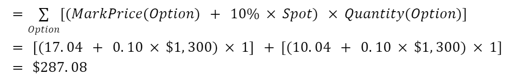

# Введение

Aevo - это высокопроизводительная децентрализованная биржа деривативов, ориентированная на опционы. Биржа работает на пользовательском EVM (виртуальная машина Эфириум). Aevo работает с внецепочечным портфелем ордеров с расчетами на блокчейн. Это означает, что после сопоставления ордеров сделки исполняются и рассчитываются с помощью смарт-контрактов.

<figure><figcaption></figcaption></figure>
